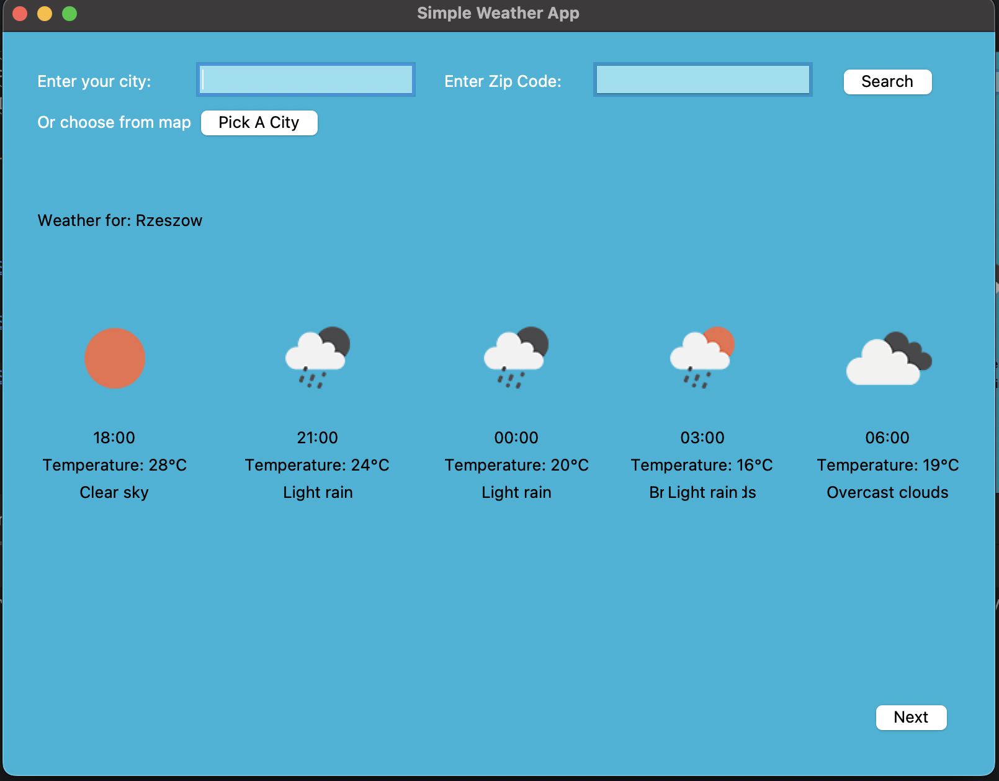
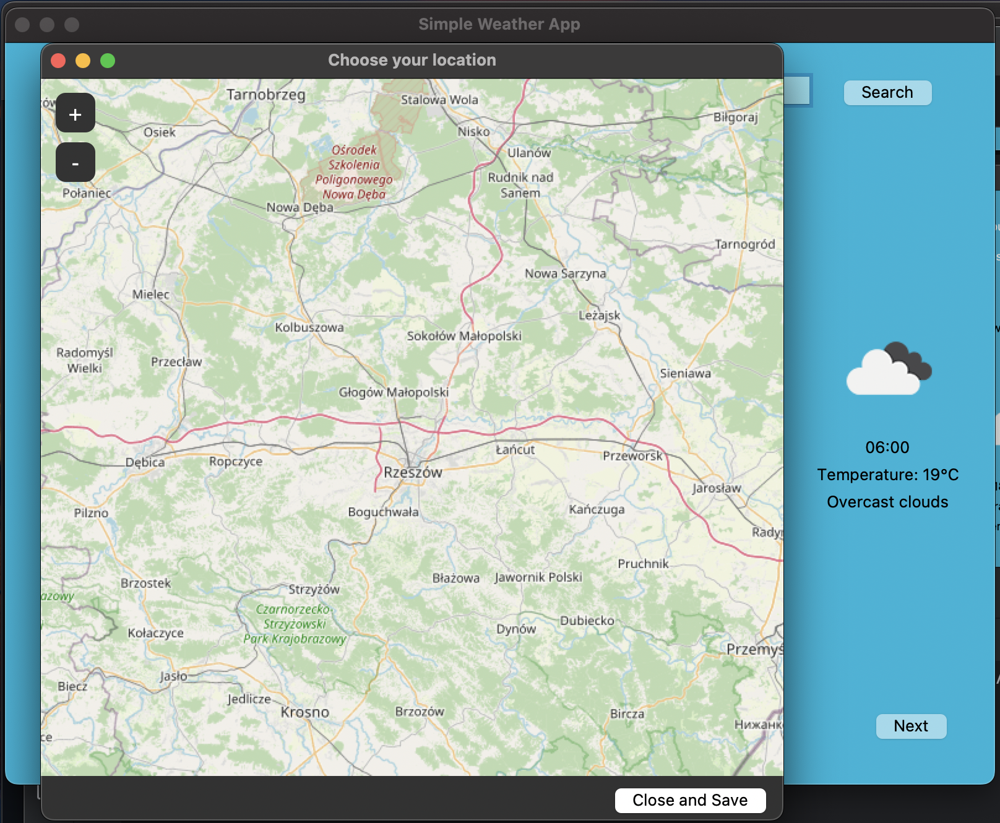
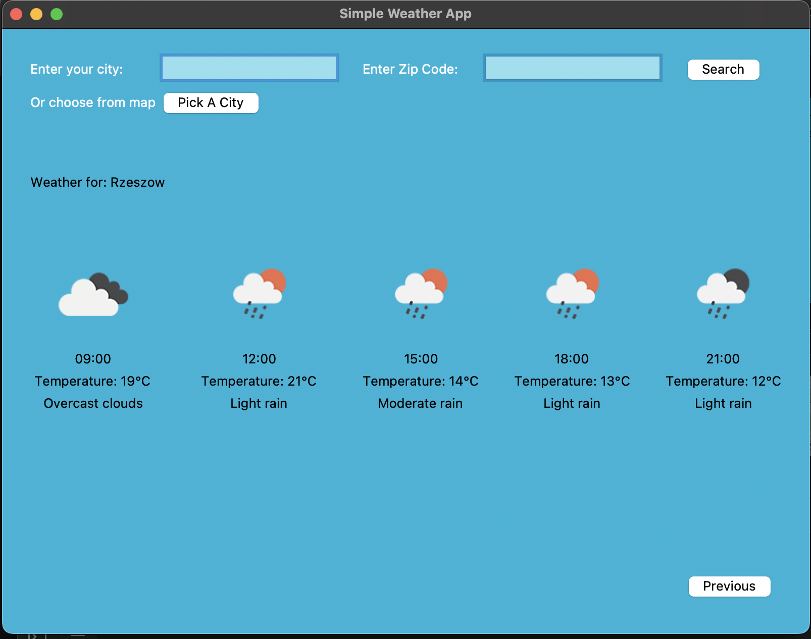

# Simple Weather App

Simple Weather App to prosta aplikacja pogodowa napisana w Pythonie. Pozwala sprawdzić pogodę dla wybranego miasta lub kodu pocztowego i wyświetla prognozę w przejrzystym GUI.

---

## Funkcje

- Wyszukiwanie lokalizacji przez nazwę miasta lub kod pocztowy  
- Wyświetlanie temperatury, opisu pogody, godziny i ikon pogodowych  
- Automatyczne zapisywanie ostatnio wybranego miasta  
- Przy starcie aplikacji wyświetlanie pogody dla ostatniej lokalizacji  
- Intuicyjny interfejs graficzny z mapą i przyciskami

---

## Zrzuty ekranu







---

## Jak uruchomić?

1. Sklonuj repozytorium:

```bash
git clone https://github.com/mikolaj-kopacz/SimpleWeatherApp
cd SimpleWeatherApp
```

2. (Opcjonalnie) stwórz i aktywuj środowisko wirtualne:

```bash
python -m venv .venv
source .venv/bin/activate    # Linux/macOS
.venv\Scripts\activate     # Windows
```

3. Zainstaluj wymagane pakiety:

```bash
pip install -r requirements.txt
```

4. Uruchom program:

```bash
python main.py
```

---

## Struktura projektu

- `weather_utils.py` – logika pobierania i przetwarzania danych pogodowych  
- `gui.py` – graficzny interfejs użytkownika  
- `last_location.py` – obsługa zapisu i wczytywania ostatniej lokalizacji  
- `icons/` – folder z pobranymi ikonami pogodowymi  
- `main.py` – główny plik startowy

---

## Wymagania

- Python 3.10 lub nowszy  
- Klucz API do [OpenWeatherMap](https://openweathermap.org/api) (wpisz go w `weather_utils.py`)

---

## Autor

Mikołaj Kopacz
